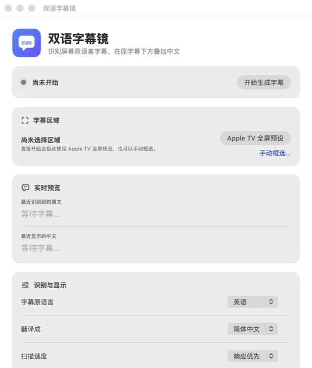
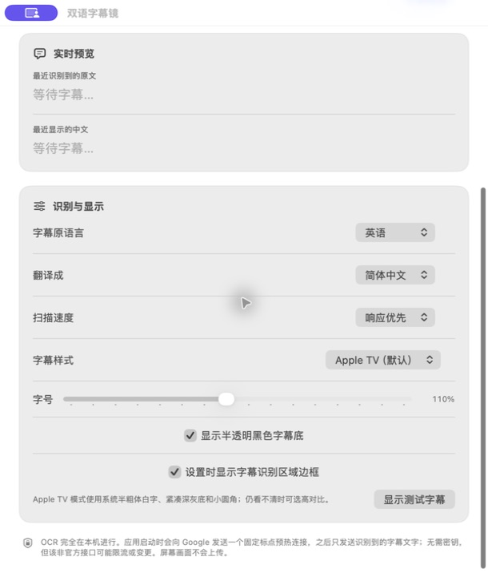
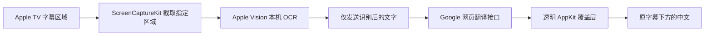

# 双语字幕镜

一款面向 macOS 与 Apple TV 的原生实时双语字幕工具。它读取 Apple TV 画面中的原语言字幕，在本机使用 Apple Vision 完成 OCR，只把识别出的文字发送给 Google 翻译，然后在原字幕下方显示稳定、清晰的中文悬浮字幕。

当前版本：**1.14（20）**

> 本项目解决的是“Apple TV 只有原语言字幕，但观看时希望同时看到中文”的场景。它不会修改 Apple TV，不注入播放器，也不会上传屏幕图像。

<p align="center">
  <a href="https://github.com/goldkingstar/bilingual-subtitle-macos/releases/latest"><strong>下载最新 macOS arm64 发行版</strong></a>
</p>

## 应用截图

| 主界面与实时预览 | 识别、显示与隐私设置 |
| --- | --- |
|  |  |

## 主要功能

- 原生 macOS 应用：Swift、SwiftUI、AppKit、ScreenCaptureKit、Vision。
- Apple TV 全屏预设：自动选择画面下方的字幕识别区域，也支持手动框选。
- 本机 OCR：屏幕画面只在当前 Mac 上处理。
- 多语言原字幕：英语、日语、繁体中文、法语、德语和西班牙语。
- 中文目标语言：简体中文或繁体中文。
- 免费翻译：使用 Google 网页翻译接口，无需 API Key。
- 快速扫描：响应优先模式每 0.12 秒检查一次字幕区域。
- 稳定字幕轨道：中文字幕固定在识别区域下方，不跟随 OCR 边界抖动。
- 快速对白双排：两句字幕在 1 秒内出现时，最多滚动保留最新两句。
- 紧凑背景：黑色字幕底按实际中文字宽度绘制，不会生成横跨画面的宽框。
- 样式设置：Apple TV、高对比、跟随原字幕颜色、字号缩放和背景开关。
- 全屏覆盖：透明、鼠标穿透，不会抢走 Apple TV 的键盘和鼠标操作。
- 翻译缓存与连接预热：减少重复请求以及首句翻译延迟。

## 工作流程



应用只在 Apple TV 位于前台时持续扫描。自身的控制窗口和字幕覆盖层会从截图中排除，避免递归识别中文字幕。

## 支持的语言

| 原字幕语言 | Vision 识别语言 | Google 语言代码 |
| --- | --- | --- |
| 英语 | `en-US` | `en` |
| 日语 | `ja-JP` | `ja` |
| 繁体中文 | `zh-Hant` | `zh-TW` |
| 法语 | `fr-FR` | `fr` |
| 德语 | `de-DE` | `de` |
| 西班牙语 | `es-ES` | `es` |

目标语言支持简体中文（`zh-CN`）和繁体中文（`zh-TW`）。

## 使用方法

1. 启动“双语字幕镜”。
2. 选择原字幕语言和中文目标语言。
3. 在 Apple TV 中打开视频并显示原语言字幕。
4. 点击“Apple TV 全屏预设”，或手动框选原字幕可能出现的完整区域。
5. 点击“开始生成字幕”。
6. 首次运行时，在“系统设置 → 隐私与安全性 → 屏幕与系统音频录制”中允许“双语字幕镜”。
7. 回到 Apple TV 全屏播放，中文会固定显示在识别区域下方。

如果授权后仍显示缺少权限，请彻底退出应用再重新打开。只要应用的 Bundle ID 和签名要求保持一致，后续覆盖升级通常不需要重新授权。

### 推荐设置

- Apple TV 全屏观看：使用“Apple TV 全屏预设”。
- 对延迟敏感：扫描速度选择“响应优先”。
- 默认样式：选择“Apple TV（默认）”。
- 浅色或复杂背景看不清：开启半透明黑底，或选择“高对比”。
- 原字幕位置特殊：使用“手动框选”，并确保框选区域下方仍有显示中文的空间。

## 字幕显示规则

- 字体大小在观看过程中保持稳定，不根据每一帧 OCR 字框缩放。
- 水平中心固定为字幕识别区域的中心，不随原字幕长短左右移动。
- 中文固定绘制在整个识别区域下方，不追随 Vision 每帧略有差异的文字边界。
- 普通新句直接替换上一句。
- 两句原字幕的检测时间间隔小于 1 秒时，上一句在上、新句在下。
- 最多显示两句；连续快速对白会滚动保留最新两句。
- 双排不会定时收缩，避免同一句突然从第二行跳到第一行。
- OCR 暂时漏掉一帧时保留短暂宽限，减少字幕闪烁。

## 隐私说明

| 数据 | 处理位置 | 是否发送到网络 |
| --- | --- | --- |
| 字幕区域画面 | 当前 Mac 的 ScreenCaptureKit 与 Vision | 否 |
| OCR 后的字幕文字 | 当前 Mac + Google 翻译 | 是 |
| 鼠标指针 | 不采集 | 否 |
| 系统音频、麦克风 | 不采集 | 否 |
| API Key | 不需要 | 否 |

应用启动或切换语言时会发送一个固定的英文句点 `.` 来预热 DNS、TLS 和连接；这个预热请求不包含用户字幕。正式工作时只发送 Vision 已识别出的字幕文字，屏幕截图不会上传。

## Google 翻译接口说明

当前使用：

```text
https://translate.googleapis.com/translate_a/single?client=gtx
```

这是 Google 网页翻译使用的非官方接口，不要求 API Key，但不提供稳定性或配额保证，可能发生限流、地区网络不可达、返回格式变化或停止服务。本项目与 Google 没有关联。

翻译结果会在内存中缓存，最多约 500 条；退出应用后不会保存字幕历史。

## 系统要求

- macOS 14 Sonoma 或更高版本。
- Apple Silicon Mac；当前直接构建脚本输出 `arm64` 应用。
- Xcode Command Line Tools，需提供 `xcrun`、Swift 编译器和 macOS SDK。
- 可访问 Google 翻译接口的网络。

Intel Mac 尚未验证。

## 从源码构建

### 1. 获取代码

```bash
git clone https://github.com/goldkingstar/bilingual-subtitle-macos.git
cd bilingual-subtitle-macos
```

### 2. 创建本机稳定签名身份

```bash
./script/create_local_signing_identity.sh
```

该脚本会在当前用户钥匙串中创建名为 `Bilingual Subtitle Local Code Signing` 的自签名代码签名身份，并只为代码签名设置本机信任。临时私钥和随机 PKCS#12 密码不会写入仓库，脚本结束时会删除临时目录。

如果你已有自己的代码签名身份，可以跳过这一步，并在构建时设置：

```bash
BILINGUAL_SUBTITLE_SIGNING_IDENTITY="你的签名身份名称" ./script/build_and_run.sh --build-only
```

### 3. 测试

```bash
./script/test.sh
```

测试包括翻译响应解析、文本归一化、快速双排边界以及六种原语言的 Vision OCR 烟雾测试。

### 4. 构建应用

```bash
./script/build_and_run.sh --build-only
```

构建结果：

- App：`/private/tmp/com.goldkingstar.BilingualSubtitle-build/双语字幕镜.app`
- 压缩包：`outputs/双语字幕镜.zip`

直接构建脚本会：

1. 用 `swiftc` 编译 arm64 可执行文件；
2. 生成原生应用图标；
3. 组装 `.app` Bundle；
4. 使用稳定身份签名；
5. 严格验证签名；
6. 生成发布压缩包。

运行临时构建：

```bash
./script/build_and_run.sh
```

验证连续构建是否保持相同的 designated requirement：

```bash
./script/verify_stable_signing.sh
```

## 项目结构

```text
Sources/BilingualSubtitle/
├── App/                    应用入口
├── Models/                 字幕、区域、语言和样式模型
├── Services/
│   ├── ScreenCaptureService.swift       局部屏幕捕获
│   ├── OCRService.swift                 Vision OCR
│   ├── GoogleTranslateService.swift     翻译、缓存与连接预热
│   ├── RegionSelectionController.swift  手动框选
│   └── SubtitleOverlayController.swift  全屏透明字幕层
├── Stores/
│   └── SubtitleCoordinator.swift        实时任务与字幕状态协调
├── Support/                文本归一化、样式和显示规则
└── Views/                  SwiftUI 控制界面

Tests/                      直接测试、OCR 与翻译烟雾测试
Resources/Info.plist        App Bundle 配置与权限说明
script/                     构建、签名、测试和图标脚本
```

## 常见问题

### 每次覆盖应用后又要求录屏权限

macOS 的屏幕录制授权不仅识别 Bundle ID，也会考虑代码签名要求。不要在每次构建时使用不同的临时签名。使用同一个本机签名身份，并通过 `verify_stable_signing.sh` 验证 designated requirement 是否保持不变。

### 能识别字幕，但没有中文

检查网络是否能访问 Google 翻译接口；短时间请求失败后应用会暂缓重试。还应确认原字幕语言选择正确。

### OCR 经常识别不到

重新框选字幕可能出现的完整区域，避免把进度条、片名和播放器控制按钮放入识别区。Apple TV 全屏播放时优先使用内置预设。

### 中文字幕挡住原字幕或位置抖动

当前版本使用固定字幕轨道：中文始终位于整个识别区域下方。如果手动框选范围过低或过大，请重新框选更贴近原字幕的区域，并在下方保留一至两行空间。

### 字幕翻译有延迟

选择“响应优先”。应用会预热翻译连接并允许最多两个快速字幕请求并行，但最终延迟仍受 OCR、网络和 Google 响应时间影响。

## 当前限制

- 依赖 Apple TV 已经显示的可见字幕，不包含音频语音识别。
- 不生成 SRT、ASS 或视频内嵌字幕文件；当前目标是实时观看覆盖。
- Google 翻译端点是非官方接口。
- 极长译文会换行或以省略号截断，最多显示两行。
- 当前只在 Apple TV 应用位于前台时扫描；其他播放器尚未开放支持。
- 当前只验证了 Apple Silicon 与 macOS 14+。

## 免责声明

本项目按现状提供，不保证 OCR、翻译结果或第三方接口始终准确、可用。请遵守所观看内容、播放器平台和所在地区适用的服务条款及法律法规。
